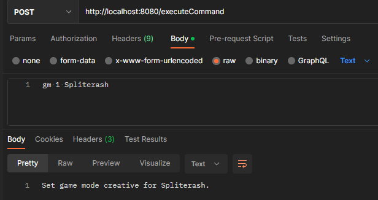

# HttpCommandExecutor

Максимально простой плагин, для выполнения команд на сервере, посредством POST запросов

```https://example.com/executeCommand```

Нужно передать `authorization` в header со значением из конфига. Всё тело запроса это команда, никаких JSON, ответ это
ответ на команду (логично)

